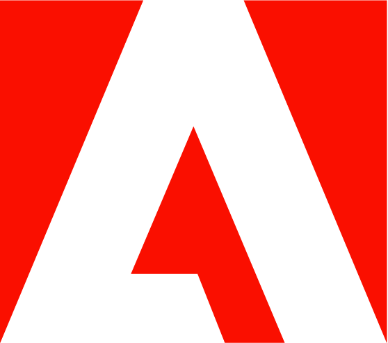

  <section class="intro grid grid-cols-1 md:grid-cols-[auto_auto] gap-8">
    <!-- left side -->
    

      
      

        

          <a href="mailto:arjun.srinivasan.10@gmail.com" class="bg-blue-50 rounded-md p-2 hover:bg-blue-100 group">
            <i class='fas fa-envelope'></i> 
            arjun.srinivasan.10@gmail.com
          </a>
        

        

          <a href="https://scholar.google.com/citations?user=your-google-scholar-id" target="_blank" class="text-gray-500 hover:text-blue-600">
            <i class="fas fa-graduation-cap"></i>
          </a>
          <a href="https://github.com/your-profile" target="_blank" class="text-gray-500 hover:text-black">
            <i class="fab fa-github"></i>
          </a>
          <a href="https://linkedin.com/in/your-profile" target="_blank" class="text-gray-500 hover:text-blue-800">
            <i class="fab fa-linkedin"></i>
          </a>
          <a href="https://x.com/your-profile" target="_blank" class="text-gray-500 hover:text-blue-400">
            <i class="fab fa-twitter"></i>
          </a>
        

      

    

    <!-- right side -->
    

      

          
            👋
            🙏
          
          I'm Arjun Srinivasan
      
        
      

          

          I'm a Lead Research Scientist at  Salesforce working on <b class="text-gray-800">intelligent and expressive tools for human-data interaction</b>. I develop systems that guide visual data analysis through proactive recommendations and multimodal interfaces allow people to freely query and interact with data.
          

          

          Previously, I was a part of the visualization team at   Databricks AI/BI, where I worked on interactive data querying and conversational interfaces for chart authoring.
          I have also built multimodal data visualization and photo editing tools during internships at  Microsoft Research and  Adobe Research.
      

      

          I received my PhD from  Georgia Tech where I worked with <a href="https://faculty.cc.gatech.edu/~john.stasko/" target="_blank" class="text-blue-400 hover:underline">John Stasko</a>.
          My dissertation focused on <a href="https://repository.gatech.edu/entities/publication/c95f50d3-72a0-4b35-9421-f8689616edf1" target="_blank" class="text-blue-400 hover:underline">multimodal human-data interaction</a> interfaces and received the <a href="https://ieeevis.b-cdn.net/vis_2021/pdfs/vgtc-dissertation.pdf" target="_blank" class='hover:text-yellow-500 hover:underline'><i class='fa fa-trophy text-yellow-500'></i> IEEE VGTC Visualization Best Dissertation Award</a>.
      

      <!-- Resume/CV -->
      

          Here's my <a href="/path-to-cv.pdf" target="_blank" class="text-blue-400 hover:bg-blue-100 rounded-md p-1 group hover:text-blue-900"><i class="fas fa-file-pdf"></i> CV</a> for more details.
      

    

    

  </section>

  <section class="select-projects space-y-4">
    
            
              <!-- 
 -->
              <h1 class="text-4xl font-medium">Select <a href="/projects" class="text-blue-900 hover:bg-blue-100 p-1 rounded-sm hover:underline">Projects</a></h1>
              

              <a href="/projects" class="text-sm font-light text-blue-900 hover:underline">(View all)</a>
    

    

      
      
            
      
    

  </section>

  <section class="select-publications space-y-4">
    
            
                <!-- 
 -->
                <h1 class="text-4xl font-medium">Select <a href="/publications" class="text-blue-900 hover:bg-blue-100 p-1 rounded-sm hover:underline">Publications</a></h1>
                

                <a href="/publications" class="text-sm font-light text-blue-900 hover:underline">(View all)</a>
    
  

    
    
      
    
  </section>

